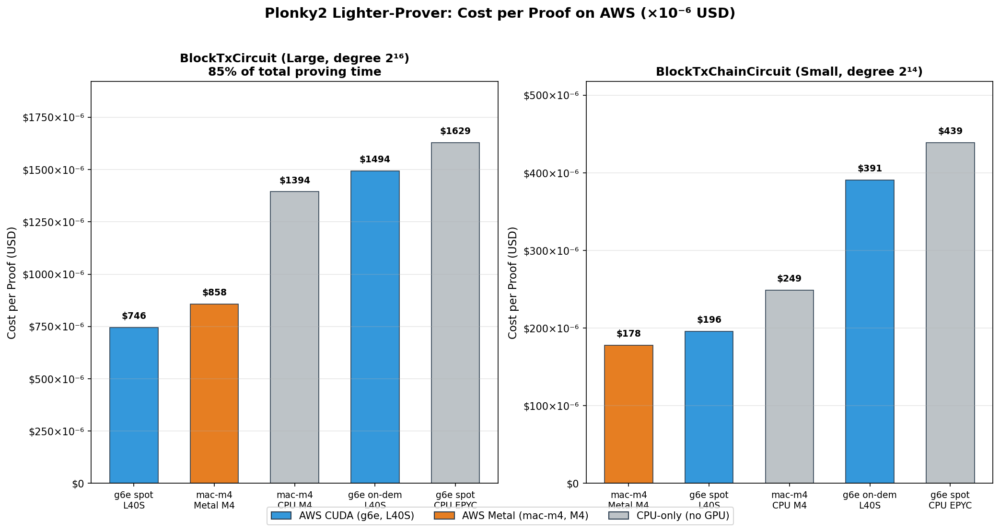

# ⚡ Plonky2 GPU Acceleration: Speedup & Cost Analysis

  
  
  

> **Date:** 2026-03-10 | **Benchmark:** [lighter-prover](https://github.com/elliottech/lighter-prover/tree/main/bench), 500 transactions (125 chunks × 4 txs)

---

## 🚀 1. Speedup Summary

###  Metal (macOS, Apple M4)

GPU Merkle Poseidon2 + Quotient Polynomial active. Measured from cold start; actual performance may vary with machine temperature and workload.

| Circuit | Size | CPU avg | GPU avg | Speedup |
|---------|------|---------|---------|---------|
| BlockTxCircuit | degree 2¹⁶, 27 gates | 4.08s | 2.47-2.55s | **1.60-1.65x** |
| BlockTxChainCircuit | degree 2¹⁴, 16 gates | 730ms | 518-525ms | **1.39-1.41x** |
| **Total (125 chunks)** | | **602s** | **374-385s** | **1.56-1.61x** |

###  CUDA (Linux, AMD EPYC 7773X + RTX 4090)

GPU LDE/NTT active.

| Circuit | Size | CPU avg (est.) | GPU avg | Speedup |
|---------|------|----------------|---------|---------|
| BlockTxCircuit | degree 2¹⁶, 27 gates | ~6.3s | 3.21s | **~2.0x** |
| BlockTxChainCircuit | degree 2¹⁴, 16 gates | ~1.7s | 841ms | **~2.0x** |
| **Total (125 chunks)** | | **~1000s** | **~507s** | **~2.0x** |

---

## ⏱️ 2. Throughput (Proofs per Hour)

### BlockTxCircuit (Large, degree 2¹⁶ — dominates 85% of total proving time)

| Platform | Avg proof time | Proofs/hour |
|----------|---------------|-------------|
| ** Metal GPU (M4)** | 2.51s | **1,434** 🏆 |
| ** CUDA GPU (RTX 4090)** | 3.21s | **1,121** |
| CPU-only (M4) | 4.08s | 882 |
| CPU-only (EPYC, est.) | ~6.3s | ~571 |

### BlockTxChainCircuit (Small, degree 2¹⁴ — higher priority per lighter team)

| Platform | Avg proof time | Proofs/hour |
|----------|---------------|-------------|
| ** Metal GPU (M4)** | 521ms | **6,911** 🏆 |
| ** CUDA GPU (RTX 4090)** | 841ms | **4,280** |
| CPU-only (M4) | 730ms | 4,932 |
| CPU-only (EPYC, est.) | ~1.7s | ~2,118 |

---

## 💰 3. Cost per Proof

### 📖 AWS Pricing: On-Demand vs Spot

AWS offers two pricing models for EC2 instances:

| Model | Description | Best for |
|-------|-------------|----------|
| **On-Demand** | Fixed hourly rate, available anytime, no interruptions | Production workloads requiring reliability |
| **Spot** | 30-70% discount using spare capacity; can be interrupted with 2 min notice | Fault-tolerant batch workloads |

### 🏷️ AWS Instance Pricing

| Instance | Hardware | Specs | On-Demand | Spot |
|----------|----------|-------|-----------|------|
| **[mac-m4.metal](https://instances.vantage.sh/aws/ec2/mac-m4.metal)** |  | 10 vCPU, 24 GiB, 10-core GPU | **$1.23/hr** | N/A |
| **[g6e.xlarge](https://instances.vantage.sh/aws/ec2/g6e.xlarge)** |  | 4 vCPU, 32 GiB, 48GB VRAM | $1.861/hr | **$0.93/hr** |

> 📌 **mac-m4.metal**: 24-hour minimum allocation (Apple licensing requirement). No spot pricing available.
>
> 📌 **g6e.xlarge**: L40S is ~10% faster than RTX 4090 for ZK workloads. CUDA GPU times scaled by 0.9x for L40S estimates.

### BlockTxChainCircuit Cost per Proof ⭐ Higher Priority

| Platform | $/hr | Proofs/hr | Cost/proof |
|----------|------|-----------|------------|
| ** Metal GPU (AWS mac-m4.metal)** | $1.23 | 6,911 | **$0.000178** |
| ** CUDA GPU (AWS g6e spot, L40S)** | $0.93 | ~4,757\* | **$0.000196** |
| CPU-only (AWS mac-m4.metal) | $1.23 | 4,932 | $0.000249 |
|  CUDA GPU (AWS g6e on-demand, L40S) | $1.861 | ~4,757\* | $0.000391 |
| CPU-only (AWS g6e spot) | $0.93 | ~2,118 | $0.000439 |

### BlockTxCircuit Cost per Proof

| Platform | $/hr | Proofs/hr | Cost/proof |
|----------|------|-----------|------------|
| ** CUDA GPU (AWS g6e spot, L40S)** | $0.93 | ~1,246\* | **$0.000746** |
| ** Metal GPU (AWS mac-m4.metal)** | $1.23 | 1,434 | **$0.000858** |
| CPU-only (AWS mac-m4.metal) | $1.23 | 882 | $0.001394 |
|  CUDA GPU (AWS g6e on-demand, L40S) | $1.861 | ~1,246\* | $0.001494 |
| CPU-only (AWS g6e spot) | $0.93 | ~571 | $0.001629 |

\*L40S estimated at ~10% faster than RTX 4090.

---

## 📈 4. Cost Efficiency Ranking

### 💡 Key Takeaways

| # | Finding |
|---|---------|
| 1 | ⭐ **BlockTxChainCircuit** (higher priority for the lighter team):  Metal mac-m4 ($0.000178) beats  CUDA g6e spot ($0.000196) by 9% |
| 2 | **BlockTxCircuit** (85% of proving time):  CUDA g6e spot ($0.000746) beats  Metal mac-m4 ($0.000858) by 13% |
| 3 |  **Metal M4 delivers the fastest wall-clock time** (2.51s BlockTx, 521ms BlockTxChain) — best choice when latency matters more than cost |
| 4 | **GPU acceleration cuts cost 38-58%** vs CPU-only on the same AWS hardware |

---

## 🔧 5. GPU Acceleration Coverage

The plonky2 proving pipeline consists of several stages. Each platform accelerates different parts:

### Proving Pipeline Stages

| Stage | Description |  |  |
|-------|-------------|:---:|:---:|
| **Witness generation** | Compute wire values from inputs | ⬜ CPU | ⬜ CPU |
| **LDE / NTT (FFT)** | Low-degree extension of polynomials | ⬜ CPU | ✅ GPU |
| **Transpose + bit-reversal** | Reorder polynomial evaluations | ⬜ CPU | ⬜ CPU |
| **Merkle tree (Poseidon2)** | Hash polynomial commitments | ✅ GPU | ⬜ CPU |
| **Quotient polynomial** | Gate constraint evaluation + alpha reduction | ✅ GPU | ⬜ CPU |
| **FRI folding** | Generate FRI proof layers | ⬜ CPU | ⬜ CPU |

### Why Different Stages?

| |  Apple UMA |  Discrete GPU |
|---|---|---|
| **Memory model** | Unified — GPU reads system memory directly, zero copy | Discrete — data must transfer over PCIe bus |
| **GPU advantage** | Memory-bound ops (hashing, gate eval) benefit from zero-copy | Compute-bound ops (FFT) benefit from massive parallelism (16K+ cores) |
| **GPU limitation** | Lower raw compute throughput | PCIe transfer overhead kills benefit for memory-bound ops |
| **Accelerated** | Merkle Poseidon2, Quotient Poly | LDE/NTT |
| **Not accelerated** | LDE (M4 GPU lacks FFT throughput) | Merkle (PCIe overhead > compute savings at prover leaf sizes) |

### What's Left on CPU (Optimization Opportunities)

| Stage | % of proving time (est.) | GPU feasibility |
|-------|------------------------|-----------------|
| **Witness generation** | ~5% | Low — irregular control flow, hard to parallelize |
| **LDE / NTT** (Metal only) | ~15% | Medium — possible with larger circuits or batched FFT |
| **Transpose + bit-reversal** | ~5% | Low — memory-bound, GPU overhead exceeds benefit |
| **FRI folding** | ~10% | Medium — sequential dependencies limit parallelism |
| **Merkle tree** (CUDA only) | ~10% | Medium — feasible if data stays on GPU (fused pipeline) |

> 💡 The most promising next optimization for CUDA is a **fused GPU pipeline** (LDE → Transpose → Merkle on GPU) to eliminate PCIe round-trips between stages. For Metal, **GPU LDE** could help once circuit sizes grow larger.

---

**Sources:**
[AWS mac-m4.metal](https://instances.vantage.sh/aws/ec2/mac-m4.metal?currency=USD) · [AWS g6e.xlarge](https://instances.vantage.sh/aws/ec2/g6e.xlarge) · [AWS EC2 Pricing](https://aws.amazon.com/ec2/pricing/on-demand/)

