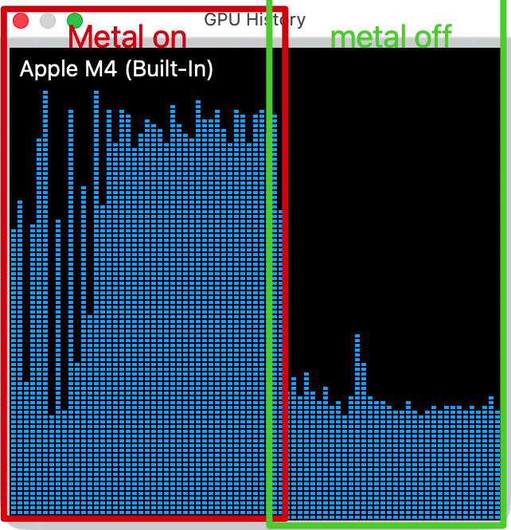

# plonky2-metal

Apple Silicon (Metal) GPU-accelerated fork of [elliottech/plonky2](https://github.com/elliottech/plonky2). Drop-in replacement — enable the `metal` feature flag and get automatic GPU acceleration with zero code changes.

## Benchmark Results

Tested on the [lighter-prover](https://github.com/elliottech/lighter-prover) benchmark (500 txs, 125 proving iterations). See [GPU_BENCHMARK_RESULTS.md](./GPU_BENCHMARK_RESULTS.md) for full details.

Speedup varies ~21-28% across runs due to thermal/load conditions; we report the conservative end.

| Configuration | Total Proving Time | Speedup vs CPU |
|--------------|-------------------|----------------|
| CPU-only | 634.3s | baseline |
| GPU Metal (Merkle + Quotient) | 498.8s | **1.27x (21.3% faster)** |

### Per-Circuit Breakdown

| Circuit | Iterations | Size | CPU-only | GPU Metal | Speedup |
|---------|-----------|------|----------|-----------|---------|
| BlockTxCircuit | 125 | Large (degree 2^16) | avg 4.29s | avg 3.39s | **1.27x (21.1%)** |
| BlockTxChainCircuit | 125 | Small (degree 2^14) | avg 774ms | avg 599ms | **1.29x (22.6%)** |
| BlockPreExecutionCircuit | 1 | Small (degree 2^14) | 859ms | 728ms | **1.18x (15.3%)** |

### GPU Usage (Metal on vs off)



Left: Metal enabled — GPU actively used for Merkle hashing and quotient polynomial evaluation. Right: Metal disabled — GPU idle, all work on CPU.

## What's Accelerated

Two proving steps are offloaded to the Metal GPU:

1. **Merkle tree construction** (Poseidon2) — GPU hashing for trees with 2^13 to 2^20 leaves
2. **Quotient polynomial evaluation** — fused gate evaluation + alpha reduction, zero device memory allocation

Both are dispatched automatically at runtime when:
- Field type is `GoldilocksField`
- Hasher is `Poseidon2Hash` (for Merkle)
- No lookup gates (for quotient poly)

If conditions are not met, the code falls back to the original CPU path. On non-macOS platforms, the `metal` feature compiles out entirely.

## How to Use

### Requirements

- **macOS** with **Apple Silicon** (M1/M2/M3/M4)
- Rust nightly toolchain

### Integration

Add `features = ["metal"]` to your plonky2 dependency:

```toml
# GPU-accelerated:
plonky2 = { git = "https://github.com/timemeansalot/plonky2-metal", package = "plonky2", features = ["metal"] }
```

That's it. No other code changes required. The Metal shader libraries are pre-compiled and embedded into the binary at build time — no need to install Metal tooling or compile shaders.

### Verify it works

You should see log output like:
```
quotient dispatch: degree_bits=16, lde_size=524288, is_goldilocks=true, has_lookup=false, num_gates=27
GPU quotient: lde_size=524288, gates=27
```

## Files Changed (vs upstream elliottech/plonky2)

| File | Change |
|------|--------|
| `plonky2/Cargo.toml` | Added `metal` and `once_cell` optional dependencies |
| `plonky2/src/hash/mod.rs` | Added `metal` module |
| `plonky2/src/hash/metal/` | **New**: GPU runtime, Merkle tree, quotient poly, buffer pool, tracking |
| `plonky2/src/hash/merkle_tree.rs` | GPU dispatch in `MerkleTree::new()` via TypeId check |
| `plonky2/src/plonk/prover.rs` | GPU dispatch in `compute_quotient_polys()` via TypeId check |
| `plonky2/src/plonk/config.rs` | Added `'static` bound to `Hasher` trait (required for TypeId) |
| `plonky2/shaders/` | **New**: Pre-compiled Metal shader libraries (`.metallib`) and source (`.metal`) |

## Upstream

Based on [elliottech/plonky2](https://github.com/elliottech/plonky2) at commit `e1c2d354` (Poseidon2 gate support).

## License

Same as upstream — Apache 2.0 / MIT dual license.
